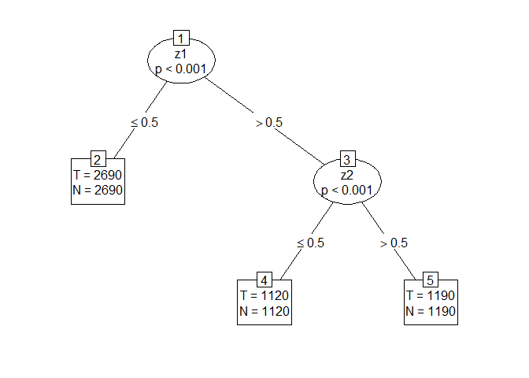

Replication files for Gutiérrez-Vargas, Vandebroek & Meulders (2023)
================
2022-11-15

This repository has all the necesary functions to replicate the results
form Gutiérrez-Vargas, Vandebroek & Meulders (2023) forthcoming at the
Journal of Choice Modelling.

The source code is contained in a small R package I developed to store
all the necesary functions which is called `MobMixlogit` and can be
found in the
[`\src`](https://github.com/alvarogutyerrez/mobmixl/tree/main/src)
folder and can be installed locally by running the R script
[`\src\install_MobMixlogit.R`](https://github.com/alvarogutyerrez/mobmixl/blob/main/src/install_MobMixlogit.R)

The different parts of the article are organized in different folders:

-   [`\simulations_replication`](https://github.com/alvarogutyerrez/mobmixl/tree/main/simulations_replication):
    contains the replications from sections 5 and 6.
-   [`\empirical_application`](https://github.com/alvarogutyerrez/mobmixl/tree/main/empirical_application):
    contains the replications from section 7.

------------------------------------------------------------------------

## Small example: Decision Tree with a Mixed Logit at the end leaves.

Here is a brief illustration on how to implement a Mixed Logit at the
end leaves using the MOB algorithm. We start by creating some data that
contains a partition.

``` r
library(MobMixlogit)
library(partykit)
library(mlogit)
# Simulate some data with a partition (see Figure 2a on the article)
df <- MobMixlogit::dgp_tree(N     = 500, # 500 individuals
                            t     = 10,  # 10 choice sets each
                            xi    = 0.5, # xi = 0.5 implies balanced groups (see Section 5.1)
                            delta = 1    # delta regulates how different are the parameters of each partition  
                            ) 
# Create the choice variable for the wide format
df$choice <- with(df,ave(x = altern * chosen,
                         group = id,
                         FUN = max))

# Delete chosen variable
df$chosen <- NULL ; df$id_choice_situation_of_individual_n <- NULL
# Reshape from long to wide.
df_wide <- stats::reshape(data      = df,
                          idvar     = c("id","id_ind"),
                          timevar   = "altern",
                          v.names   = c("x1", "x2"),
                          direction = "wide",
                          sep       = "_")
```

Now we have to create an auxiliary function that will be useful to run
the Mixed Logit model using `mlogit`.

``` r
# Create a auxiliar function to make mlogit work together with partykit.
mixl_for_partykit <- function(y,
                              x = NULL,
                              start = NULL,
                              weights = NULL,
                              offset = NULL, ...) {
  # Create an artificial dataset binding the x's and the choice variable (y)
  yx <- cbind(y,x)
  # Declare dfidx data
  d <- dfidx::dfidx(data = yx,
             shape = "wide",
             choice = "choice",
             varying = 2:7, ## first if "y", then "x's" and finally "identifiers".
             sep = "_",
             idx = list(c("id", "id_ind")),  #obs= choice situation; id = individual
             idnames = c(NA, "altern"))

  # Fit a Mixed Logit using mlogit to the "d" data.
  clogit_dfidx <- mlogit::mlogit(formula = choice ~ x1 + x2 |0 ,  #+0 to drop intercepts
                         data    = d,           # dataset
                         rpar    = c(x1 = 'n',  # Both random parameters are assumed normal
                                     x2 = 'n'), 
                         R       = 500,         # Number of Halton draws
                         panel   = TRUE,        # Activate Panel structure (more than one response per individual)
                         method = 'bhhh')       # Optimization technique.

  return(clogit_dfidx)
}
```

Then we call the `partykit::mob()` function and provide our auxiliary
function `mixl_for_partykit` as our model fit to it.

``` r
(mob_mixl <- partykit::mob(formula = choice ~      # Choice variable
                            x1_1 + x1_2 + x1_3 +  # Variables for the first attribute
                            x2_1 + x2_2 + x2_3 +  # Variables of the second attribute
                            id + id_ind + 0  |    # Identifiers + drop the intercept.
                            z1 +z2 + z3 + z4 + z5 ,
                        data = df_wide,           # data set to be used (wide format)
                        fit = mixl_for_partykit,  # auxiliary function just defined above
                        cluster = id_ind,         # cluster standard errors by individual
                        control = partykit::mob_control(
                          ytype = "data.frame",   # Declare the choice variable as data.frame()
                          xtype = "data.frame",   # Declare the attribute variables as data.frame()
                          minsize = 100,          # Minimum number of choice sets to create a partition
                          alpha   = 0.05 )))      # Level of confidence to reject null hypothesis
```

    ## Model-based recursive partitioning (mixl_for_partykit)
    ## 
    ## Model formula:
    ## choice ~ x1_1 + x1_2 + x1_3 + x2_1 + x2_2 + x2_3 + id + id_ind + 
    ##     0 | z1 + z2 + z3 + z4 + z5
    ## 
    ## Fitted party:
    ## [1] root
    ## |   [2] z1 <= 0.5: n = 2690
    ## |              x1        x2     sd.x1     sd.x2 
    ## |       0.9772931 1.0125683 0.4678080 0.4293633 
    ## |   [3] z1 > 0.5
    ## |   |   [4] z2 <= 0.5: n = 1120
    ## |   |              x1        x2     sd.x1     sd.x2 
    ## |   |       1.9899722 1.9976571 0.5546160 0.3708133 
    ## |   |   [5] z2 > 0.5: n = 1190
    ## |   |              x1        x2     sd.x1     sd.x2 
    ## |   |       3.1129389 2.0251336 0.2657006 0.4117270 
    ## 
    ## Number of inner nodes:    2
    ## Number of terminal nodes: 3
    ## Number of parameters per node: 4
    ## Objective function: 3084.055

Finally, we can also provide a graphical illustration of the estimated
tree.

<!-- -->

------------------------------------------------------------------------

## MOB algorithm as variable selection

In our article we also provided an illustration of one possible way to
use the MOB algorithm as a variable selection step for the allocation
model of Latent Class models. You can find this code in the script
[`\simulations_replication\MOB_MNL_on_LCMIXL_data.R`](https://github.com/alvarogutyerrez/mobmixl/blob/main/empirical_application/MOB_as_diagnostic_tool/MOB_MNL_diagnostic.R).
